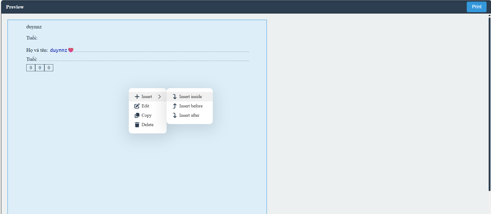
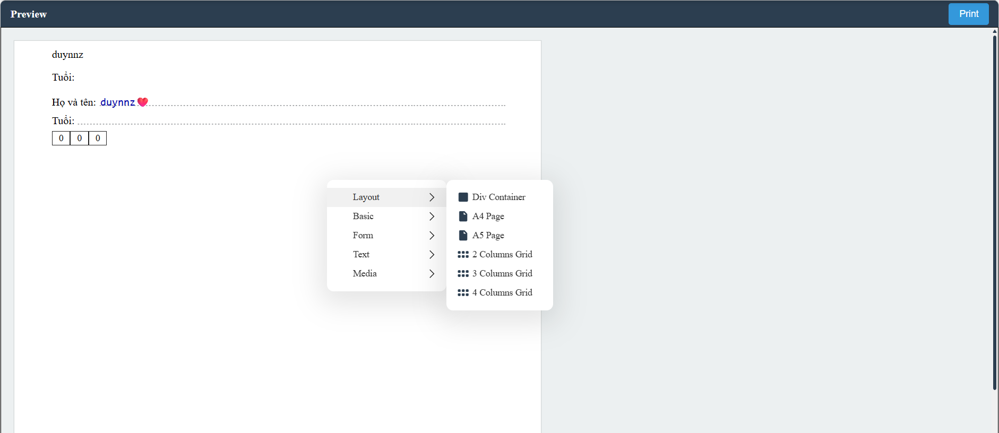
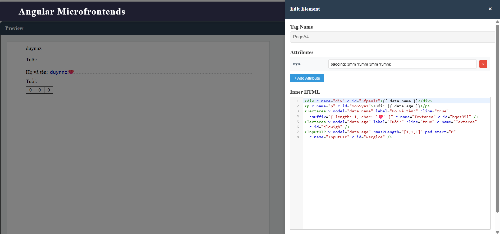

# 🧩 Template Editor Component

The **Template Editor Component** is an **Angular Standalone Component** that enables you to **edit and preview** HTML templates with **Vue 3 integration** for rendering dynamic content.

---

## 🚀 Installation

Install or import the **component** into your module as a **standalone component**.  
Ensure you have initialized the Vue module before use.

---

## 💡 Example
```typescript
import { Component, ViewChild } from '@angular/core';
import { TemplateEditor } from '../../components/template-editor/template-editor';
import { FormsModule } from '@angular/forms';

@Component({
  selector: 'app-shell-home',
  imports: [FormsModule, TemplateEditor],
  templateUrl: './home.html',
  styleUrl: './home.scss'
})
export class Home{
  @ViewChild(TemplateEditor) templateEditor!: TemplateEditor;
  template = `<PageA4 style="padding: 3mm 15mm 3mm 15mm;">
  <div>{{ data.name }}</div>
  <p>Age: {{ data.age }}</p>
  <Textarea
    v-model="data.name"
    label="Name:"
    :suffix="{ length: 1, char: '❤️' }"
  />
  <InputOTP
    v-model="data.age"
    :maskLength="[1,1,1]"
    pad-start="0"
  />
</PageA4>`
  data: any = { name: 'duynnz', age: '21' }
}

```

```html
<template-editor
  [(template)]="template"
  [(data)]="data"
></template-editor>
```
## 🔍 Preview




🎯 Live Demo: https://duynndu.github.io/mfe-angular/shell/